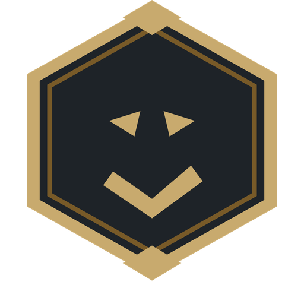

<div align="center">


# VibeCheck.lol

**Winrate is temporary. The vibes are forever.**

</div>

VibeCheck.lol sits quietly in your system tray. When a League game ends it
asks one question — **"How was that game?"** — you click a face, and that's it.
Over time it shows you which champions, teammates, and situations you genuinely
enjoy, as opposed to the ones you merely win with.

Because winning Yasuo games while being miserable is still being miserable.

---

## Install (2 minutes, no technical knowledge needed)

1. Download **`LeagueOfKiffance.exe`** from the
   [latest release](../../releases/latest).
2. Put it anywhere you like — your Desktop is fine.
3. Double-click it.

Windows may show a blue **"Windows protected your PC"** box the first time.
That appears for any app that isn't code-signed (signing costs a few hundred
euros a year). Click **More info → Run anyway**.

A small gold hexagon appears near your clock. That's it — it's running.
If you can't see it, click the **^** arrow next to the clock; Windows hides new
tray icons there.

## Using it

**Just play.** You don't have to do anything.

- When a game ends, a popup asks how it felt. **Click one face.** Done.
- Miss it? Nothing is lost — the game waits in **To Rate** in the dashboard.
- **Click the tray icon** to open your dashboard and see your stats.

The app does **not** start automatically with Windows. After a reboot,
double-click it again.

## What you get

| | |
|---|---|
| **The Vibe Check** | Your average kiff, best and worst champions, squad effect |
| **Champions** | Fun vs. winrate — find the champs you win with but hate |
| **The Squad** | Whether your friends actually make games better |
| **Regret Curve** | Which game of the night your fun falls off a cliff |
| **Tags** | Label games ("int diff", "clutched it") and see what correlates |
| **Explorer** | Slice fun by enemy champion, augment, item, role, hour… |
| **Squad Online** | *(optional)* compare kiff scores with friends |

Every stat shows its sample size, and anything under 5 games is marked
"not enough data yet" instead of pretending to be meaningful.

## Playing with friends

No signup, no accounts, no codes — it just works. Your squad is simply **your
League friends who also run Kiffance**. Once a friend installs it and you have
each other friended in-game, you show up in each other's **Squad Online** tab
automatically.

Then you get a squad leaderboard and the **mutual kiff matrix**: when two of you
played the *same* game, it shows both ratings side by side. You rated it 5/5,
they rated it 2/5 — that's the argument settled with data.

*(Nothing about your games is shared with anyone who isn't a mutual League
friend also running the app.)*

## Is this safe? Will I get banned?

**No.** It only reads the League *client's* own local API — the same mechanism
apps like Blitz and Porofessor use. It never touches the game process, never
shows anything during a game, never automates input, and gives no competitive
advantage whatsoever. It literally just asks whether you had fun.

Your data stays **on your PC** in `%LOCALAPPDATA%\LeagueOfKiffance\`. Only your
*rated* games sync to Squad Online, and they're visible only to mutual League
friends who also run the app — never to anyone else.

## Troubleshooting

**No tray icon?** Check the **^** arrow by the clock. Still nothing — the app
probably crashed; see the log at
`%LOCALAPPDATA%\LeagueOfKiffance\kiffance.log`.

**Games not being captured?** The app must be running *before* the game ends.
If it was closed, it catches up the next time it starts — as long as the game
still appears in your client's match history.

**"Port already in use"?** Another program has port 8577. Set `KIFFANCE_PORT`
to a free port and relaunch.

**Want to start fresh?** Quit from the tray, then delete (or move)
`%LOCALAPPDATA%\LeagueOfKiffance\kiffance.sqlite3`.

---

## For developers

```powershell
py -m venv .venv
.venv\Scripts\pip install -r requirements.txt -r requirements-dev.txt
.venv\Scripts\python -m kiffance              # run from source
.venv\Scripts\python tests\smoke_test.py      # tests (no League needed)
.venv\Scripts\pyinstaller kiffance.spec --noconfirm   # build the exe
```

Design and decisions: [PRD.md](PRD.md) · Workflow: [CONTRIBUTING.md](CONTRIBUTING.md) ·
Releasing: [docs/RELEASE.md](docs/RELEASE.md)

---

VibeCheck.lol isn't endorsed by Riot Games and doesn't reflect the views or
opinions of Riot Games or anyone officially involved in producing or managing
Riot Games properties.
